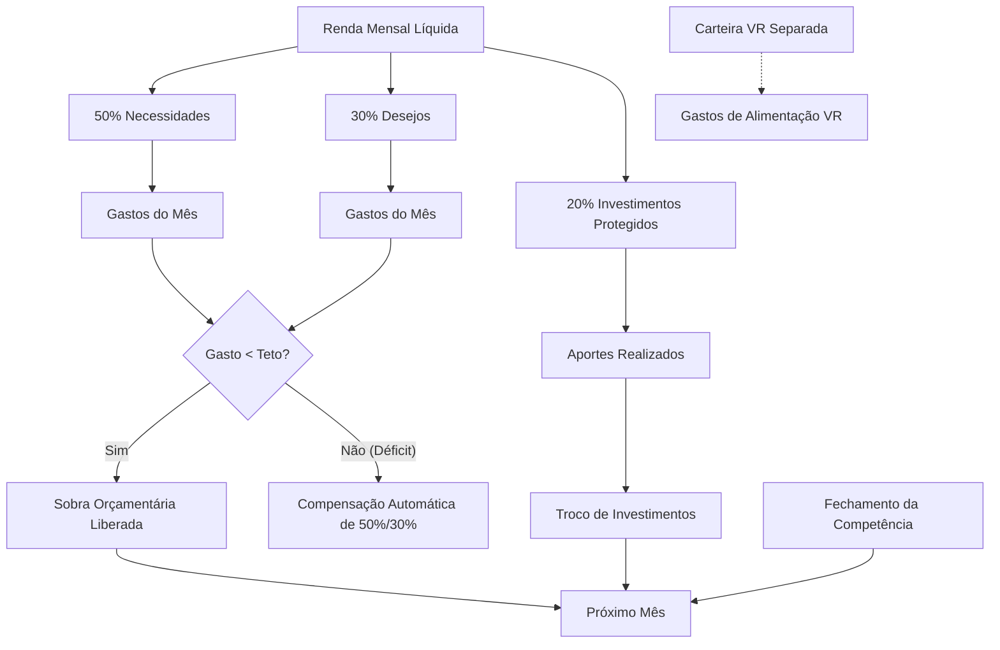

# FinFlow — Documento Consolidado de Evolução, Arquitetura & Design

> **Status do Projeto**: Versão em Produção **`v1.1.0` (Code 10)**  
> **Acesso Web Oficial**: [https://fin-flow-app.web.app](https://fin-flow-app.web.app)  
> **Repositório GitHub**: [https://github.com/juanalenca/fin-flow](https://github.com/juanalenca/fin-flow)  
> **Data de Fechamento**: 28 de Agosto de 2026  

---

## 1. Visão Geral & Escopo Executivo

O **FinFlow** é uma aplicação progressiva e nativa híbrida (Web + Android via Capacitor) de controle financeiro pessoal fundamentada na metodologia orçamentária **50/30/20** com gestão isolada de benefícios corporativos (**Carteira VR/Alimentação**).

Este documento reúne todas as decisões arquiteturais, resoluções de problemas de infraestrutura/deploy, engenharia matemática de cálculo, padronização visual (*Design Skills* & *Impeccable Craft*) e as otimizações mobile executadas do início ao fim de nossas sessões.

```
┌─────────────────────────────────────────────────────────────────────────────┐
│                           ARQUITETURA DO FINFLOW                            │
├────────────────────────┬──────────────────────────┬─────────────────────────┤
│    Camada Visual       │   Engenharia de Regras   │     Infraestrutura      │
│  (UI/UX & Responsivo)  │     (Motor Financeiro)   │   (Cloud & Multi-Plat)  │
├────────────────────────┼──────────────────────────┼─────────────────────────┤
│ • Design Impeccable    │ • Método 50/30/20        │ • Firebase Auth         │
│ • Micro-transições     │ • Carteira VR Isolada    │ • Cloud Firestore Sync  │
│ • Dock Mobile Simétrico│ • Fechamento de Mês      │ • Firebase Multi-Site   │
│ • SVG Gráficos Nativos │ • Sobras & Compensação   │ • Capacitor Android     │
└────────────────────────┴──────────────────────────┴─────────────────────────┘
```

---

## 2. Linha do Tempo e Evolução dos Desafios

### 2.1. Ajuste de Identidade, Domínio e Multi-Site Firebase
- **Problema inicial**: O deploy estava apontando para um site alternativo antigo (`mapeamento-esportivo.web.app`) e apresentava inconsistência de nomenclatura (`fn-flow` vs `fin-flow`).
- **Resolução**:
  - Configuração de múltiplos targets no `firebase.json` (`fin-flow-app` e `fn-flow`).
  - Criação e ativação do site de produção primário: **`fin-flow-app.web.app`**.
  - Padronização definitiva da marca em todo o código e telas para **FinFlow**.

### 2.2. Transições Suaves & Fluidez de Interface (v1.0.8)
- **Desafio**: A troca entre abas e visões era instantânea e rígida.
- **Implementação**:
  - Aplicação de curvas de desaceleração física natural: `cubic-bezier(0.22, 1, 0.36, 1)` e `cubic-bezier(0.16, 1, 0.3, 1)`.
  - Micro-transições `viewFadeIn` para o conteúdo principal e `titleFadeIn` para títulos e subtítulos.
  - Indicador deslizante dourado no menu lateral desktop e animação de escala suave nos ícones da barra de navegação.
  - Varredura de qualidade via `impeccable detect` sem nenhum anti-padrão de animação.

### 2.3. Redesign dos 3 Cards de Gestão Dinâmica (v1.0.9)
- **Problema**:
  1. *Anti-padrão de Nested Cards*: Caixas tracejadas internas dentro de painéis.
  2. *Quebra de Linha Truncada*: Texto com ponto isolado (`"Objetivos ou Investimentos ."`).
  3. *Assimetria*: Colunas desiguais (`.85fr` vs `1.45fr`).
  4. *Barra de Fechamento Amadora*: Strings brutas separadas por pipes (`|`).
- **Transformação**:
  - **Grid Simétrico**: `.dynamic-workspace` reestruturado para `repeat(2, minmax(0, 1fr))` com alinhamento milimétrico.
  - **Card de Pendências**: Superfície sólida, badge semântico verde esmeralda `[✓ 0 pendências]` e micro-barras de progresso em tempo real (Gasto vs Teto de 50% e 30%).
  - **Card de Sobras**: Cálculo em tempo real da sobra prevista da competência atual (ex: `R$ 285,07`) com regras de alocação formatadas.
  - **Painel de Fechamento (Command Center)**: Pílula de status dinâmica (`🟢 Competência 2026-08 em Aberto`), botão CTA dourado `[🔒 Fechar Mês]` e **2 cartões de KPIs destacados** (Troco de Investimentos 20% Protegido e Sobras de Orçamento 50%/30%).

### 2.4. Ergonomia, Legibilidade e Sessão Mobile (v1.1.0)
- **Gráfico de Evolução Acumulada no Mobile**:
  - Criação de escala adaptativa: `viewBox="0 0 420 220"` no mobile vs `840x260` no desktop.
  - Tipografia de eixos renderizada em `11.5px` (nítida e legível em telas pequenas).
  - Compactação da barra de indicadores em grid 2x2, destinando mais de 70% do espaço vertical para a curva visual de gastos.
- **Card "Distribuição de Gastos" (Donut Chart)**:
  - Legenda reestruturada em linhas verticais completas de largura total (`100%`), eliminando o corte de texto (`30% Desej...`).
  - Alinhamento visual: Nome da categoria à esquerda, porcentagem e valor em R$ perfeitamente posicionados à direita.
- **Dock Inferior Mobile 100% Simétrico**:
  - Eliminação da assimetria (havia 3 abas à esquerda e 4 à direita do botão `+`).
  - Grid de 7 colunas perfeitamente balanceado:
    $$\text{[Geral]} \quad \text{[50\%]} \quad \text{[30\%]} \quad \mathbf{\big[+\big]} \quad \text{[20\%]} \quad \text{[Metas]} \quad \text{[Extrato]}$$
  - Reposicionamento do atalho da Carteira VR para o cabeçalho superior.
- **Gestão de Conta & Logout no Mobile**:
  - Criação do **Modal / Bottom Sheet de Conta (`#account-dialog`)**, acionado com 1 toque no avatar do usuário.
  - Exibição de Avatar com iniciais, Nome, E-mail e indicador de sincronização em nuvem.
  - Inclusão do botão de ação em vermelho suave **`[🚪 Sair da Conta (Logout)]`** com confirmação de segurança.
  - Botão de acesso rápido a Configurações no topo.

---

## 3. Engenharia de Regras Financeiras (50/30/20 + VR)

O núcleo de regras está isolado no módulo [`financial-engine.js`](file:///c:/Users/SAD/Documents/fin-flow/static/financial-engine.js) e coberto por testes unitários automatizados em [`financial-engine.test.mjs`](file:///c:/Users/SAD/Documents/fin-flow/static/financial-engine.test.mjs).



### Principais Fórmulas & Regras:
1. **Tetos Base**:
   $$\text{Teto Necessidades} = \text{Renda} \times 0.50$$
   $$\text{Teto Desejos} = \text{Renda} \times 0.30$$
   $$\text{Teto Investimentos} = \text{Renda} \times 0.20$$
2. **Troco de Investimentos (20% Protegido)**:
   $$\text{Troco Investimento} = \max(0, \, \text{Teto Investimentos} - \text{Aportes Realizados})$$
   *Garante que o capital destinado a investimentos não gasto seja somado ao teto de investimentos do mês seguinte, sem jamais virar consumo.*
3. **Sobras de Orçamento (50% e 30%)**:
   $$\text{Sobra Necessidades} = \max(0, \, \text{Teto Necessidades} - \text{Gasto Realizado})$$
   $$\text{Sobra Desejos} = \max(0, \, \text{Teto Desejos} - \text{Gasto Realizado})$$
   $$\text{Sobra Total} = \text{Sobra Necessidades} + \text{Sobra Desejos}$$
   *Ao fechar o mês, essa quantia é liberada para Metas/Objetivos ou amortização de pendências.*
4. **Isolamento de VR**:
   - Transações com `budget_type = "vr"` consomem apenas o saldo inicial e recargas de VR, sem interferir no fluxo de caixa nem distorcer a regra 50/30/20 da renda.

---

## 4. Estrutura Técnica dos Arquivos Modificados

| Arquivo | Função Principal | Alterações Realizadas |
| :--- | :--- | :--- |
| [`static/index.html`](file:///c:/Users/SAD/Documents/fin-flow/static/index.html) | Estrutura semântica e DOM | Inclusão do header mobile com chip VR/configurações, dock simétrico de 7 colunas, modal `#account-dialog` com logout, versionamento `v1.1.0`. |
| [`static/styles.css`](file:///c:/Users/SAD/Documents/fin-flow/static/styles.css) | Sistema de design e responsividade | Transições fluidas, eliminação de nested cards, layout vertical da legenda do Donut, SVG responsivo, grid do dock mobile, modal de conta. |
| [`static/app.js`](file:///c:/Users/SAD/Documents/fin-flow/static/app.js) | Lógica de aplicação e UI | Integração do modal de conta mobile, handler de logout, `toggleSettings`, renderização dinâmica responsiva de SVG, versionamento `1.1.0`. |
| [`static/version.json`](file:///c:/Users/SAD/Documents/fin-flow/static/version.json) | Metadados de OTA Live Update | Atualizado para versão `1.1.0`, versionCode `10` e changelog. |
| [`android/app/build.gradle`](file:///c:/Users/SAD/Documents/fin-flow/android/app/build.gradle) | Configuração nativa Android | `versionCode 10` e `versionName "1.1.0"`. |
| [`firebase.json`](file:///c:/Users/SAD/Documents/fin-flow/firebase.json) | Configuração de hosting | Multi-site configurado com targets `fin-flow-app` e `fn-flow`. |

---

## 5. Como Executar e Validar

### 5.1. Testes Automatizados e Auditoria de Design
```powershell
# 1. Validação de sintaxe e testes do motor financeiro
node --check static/app.js
node --check static/financial-engine.js
node static/financial-engine.test.mjs

# 2. Verificação de anti-padrões visuais (Impeccable Craft)
$env:Path = "C:\Program Files\nodejs;" + $env:Path
node ./node_modules/impeccable/cli/bin/cli.js detect static/
```

### 5.2. Sincronização Mobile & Deploy Web
```powershell
# Sincronização dos assets web com o projeto nativo Android
npx cap sync android

# Deploy de produção para o Firebase Hosting
npx firebase-tools deploy --only hosting
```

---

## 6. Conclusão e Próximos Passos

O **FinFlow** encontra-se em um estado maduro, com código enxuto (zero dependências pesadas no front-end), motor financeiro matematicamente sólido e validado por testes unitários, visual profissional em modo escuro de alto contraste (*Onyx/Amber/Emerald/Sapphire/Rose*), e ergonomia mobile nativa e simétrica.
